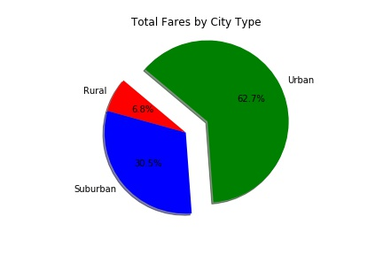
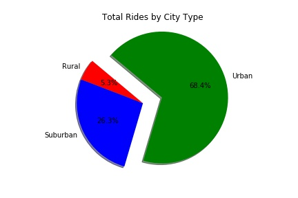
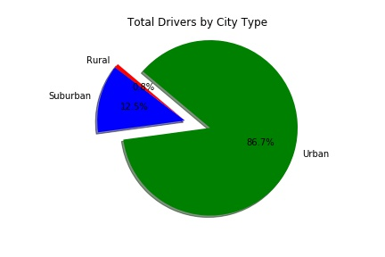

# I was talked with  build a Bubble Plot that showcases the relationship between four key variables:
Average Fare ($) Per City

Total Number of Rides Per City

Total Number of Drivers Per City

City Type (Urban, Suburban, Rural)

# In addition, I was able to three pie charts:

% of Total Fares by City Type

% of Total Rides by City Type

% of Total Drivers by City Type

# As final considerations:

I had to  use the Pandas Library and the Jupyter Notebook.
I had to use the Matplotlib library.
I had toinclude a written description of three observable trends based on the data.
I had to use proper labeling of your plots, including aspects like: Plot Titles, Axes Labels, Legend Labels, Wedge Percentages, and Wedge Labels.

I had to  stick to the Pyber color scheme (Gold, Light Sky Blue, and Light Coral) in producing your plot and pie charts.
When making your Bubble Plot, experiment with effects like alpha, edgecolor, and linewidths.
When making your Pie Chart, experiment with effects like shadow, startangle, and explosion.

# my analazyas of the data 
Based on the data that was given I  it is just what I had though that the bigger cities and more densely populated area have more drivers and rides then Urban areas. It would be fun to start a project from gathering data to programming. 
